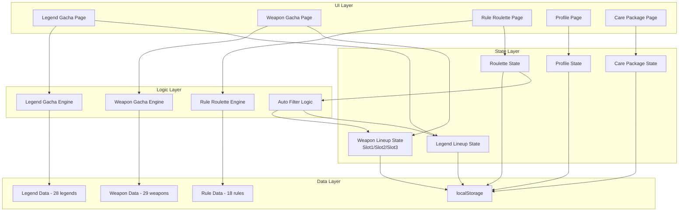
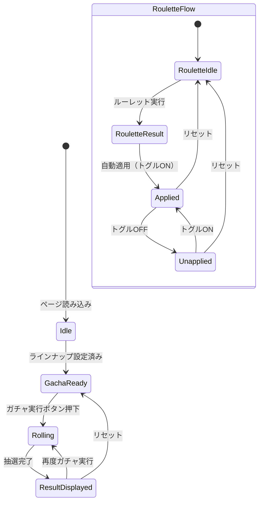

# Design Document: Apex Gacha System

## Overview

Apex Gacha Systemは、Apex Legendsのカスタムマッチ向けランダム選択支援Webアプリケーションである。レジェンドピックガチャ、武器ガチャ、縛りルールルーレットの3機能を提供し、ホストがチェックボックスでラインナップを制御できる。

### 技術スタック

- **フレームワーク**: React 18+ with TypeScript
- **ビルドツール**: Vite
- **状態管理**: React Context + useReducer（軽量かつ外部依存なし）
- **スタイリング**: CSS Modules（コンポーネントスコープのスタイル）
- **永続化**: localStorage API
- **テスト**: Vitest + fast-check（プロパティベーステスト）
- **デプロイ**: 静的サイトホスティング（Vercel/Netlify等）

### 設計方針

1. **クライアント完結**: サーバー不要、全データはブラウザ内で管理
2. **静的データ**: レジェンド・武器データはハードコード（APIコール不要）
3. **即時反映**: チェックボックス変更は即座にガチャ対象に反映
4. **状態分離**: 各ガチャ機能の状態は独立管理、ルーレット結果のみが横断的に作用

## Architecture

### システム構成図



### 状態フロー図



## Components and Interfaces

### コンポーネント構成

```
src/
├── components/
│   ├── legend/
│   │   ├── LegendGacha.tsx          # レジェンドガチャメイン
│   │   ├── LegendLineup.tsx         # レジェンドラインナップ制御
│   │   ├── LegendResult.tsx         # ガチャ結果表示
│   │   └── PartyGacha.tsx           # パーティ編成ガチャ
│   ├── weapon/
│   │   ├── WeaponGacha.tsx          # 武器ガチャメイン
│   │   ├── WeaponSlotLineup.tsx     # スロット別ラインナップ
│   │   ├── WeaponResult.tsx         # 武器結果表示
│   │   └── CarePackageManager.tsx   # ケアパッケージ武器管理
│   ├── roulette/
│   │   ├── RuleRoulette.tsx         # ルーレットメイン
│   │   ├── RouletteResult.tsx       # ルーレット結果表示
│   │   └── RouletteControls.tsx     # リセット/適用トグル
│   ├── profile/
│   │   └── UserProfile.tsx          # ユーザープロフィール
│   └── shared/
│       ├── CheckboxGroup.tsx        # 汎用チェックボックスグループ
│       ├── ClassGroupCheckbox.tsx   # クラス/カテゴリ単位選択
│       └── ErrorMessage.tsx         # エラーメッセージ表示
├── hooks/
│   ├── useLegendGacha.ts
│   ├── useWeaponGacha.ts
│   ├── useRuleRoulette.ts
│   └── useLocalStorage.ts
├── engines/
│   ├── legendGachaEngine.ts         # レジェンド抽選ロジック
│   ├── weaponGachaEngine.ts         # 武器抽選ロジック
│   ├── rouletteEngine.ts            # ルーレット抽選ロジック
│   └── autoFilterEngine.ts          # ルーレット結果→チェックボックス自動制御
├── data/
│   ├── legends.ts                   # レジェンドマスターデータ
│   ├── weapons.ts                   # 武器マスターデータ
│   └── rules.ts                     # 縛りルールマスターデータ
├── types/
│   └── index.ts                     # 型定義
└── utils/
    ├── random.ts                    # 乱数ユーティリティ
    ├── storage.ts                   # localStorage操作
    └── filter.ts                    # フィルタリングユーティリティ
```

### 主要インターフェース

#### ガチャエンジンインターフェース

```typescript
// legendGachaEngine.ts
interface LegendGachaEngine {
  /** ラインナップからランダムに1人選択 */
  pickOne(lineup: Legend[]): Legend;
  
  /** パーティガチャ: 重複なしでn人選択 */
  pickParty(lineups: Legend[][], partySize: number): Legend[];
  
  /** 有効なラインナップを計算（ホスト設定 ∩ ユーザープロフィール） */
  getEffectiveLineup(
    hostLineup: Set<string>,
    userProfile: Set<string>,
    allLegends: Legend[]
  ): Legend[];
}

// weaponGachaEngine.ts
interface WeaponGachaEngine {
  /** 指定スロットのラインナップからランダムに1丁選択 */
  pickWeapon(lineup: Weapon[]): Weapon;
  
  /** 全スロット同時ガチャ */
  pickAllSlots(slot1Lineup: Weapon[], slot2Lineup: Weapon[]): [Weapon, Weapon];
}

// rouletteEngine.ts
interface RouletteEngine {
  /** 18種類のルールからランダムに1つ選択 */
  spin(rules: Rule[]): Rule;
}

// autoFilterEngine.ts
interface AutoFilterEngine {
  /** ルーレット結果に基づいてチェックボックス状態を計算 */
  applyRule(rule: Rule, legends: Legend[], weapons: Weapon[]): FilterResult;
}
```

#### フィルタ結果インターフェース

```typescript
interface FilterResult {
  /** レジェンドクラス縛りの場合のチェック状態 */
  legendChecks?: Map<string, boolean>;
  /** 武器カテゴリ/弾薬縛りの場合のSlot1チェック状態 */
  weaponSlot1Checks?: Map<string, boolean>;
  /** Slot2は変更しない（undefined） */
  weaponSlot2Checks?: undefined;
}
```

## Data Models

### 型定義

```typescript
// === レジェンド関連 ===

type LegendClass = 'Assault' | 'Skirmisher' | 'Recon' | 'Support' | 'Controller';

interface Legend {
  id: string;                    // 一意識別子（英語名ベース）
  name: string;                  // 表示名（日本語）
  class: LegendClass;           // 所属クラス
  imagePath: string;            // キャラクター画像パス
  hasThirdWeaponSlot: boolean;  // バリスティック用フラグ
}

// === 武器関連 ===

type WeaponCategory = 'Shotgun' | 'SMG' | 'Pistol' | 'AR' | 'LMG' | 'Marksman' | 'Sniper';
type AmmoType = 'Shotgun' | 'Light' | 'Heavy' | 'Energy' | 'Sniper' | 'Arrow';

interface Weapon {
  id: string;                    // 一意識別子（英語名ベース）
  name: string;                  // 表示名（日本語）
  category: WeaponCategory;     // 武器カテゴリ
  ammoTypes: AmmoType[];        // 弾薬種類（C.A.R.は['Light','Heavy']）
  isCarePackage: boolean;       // ケアパッケージ武器フラグ
}

// === 縛りルール関連 ===

type RuleCategory = 'LegendClass' | 'WeaponCategory' | 'AmmoType';

interface Rule {
  id: string;                    // 一意識別子
  name: string;                  // ルール表示名（日本語）
  category: RuleCategory;       // ルールカテゴリ
  filterValue: string;          // フィルタ対象値（クラス名/カテゴリ名/弾薬名）
}

// === 状態管理 ===

interface LegendLineupState {
  /** レジェンドID → チェック状態 */
  checks: Map<string, boolean>;
}

interface WeaponLineupState {
  /** スロット1: 武器ID → チェック状態 */
  slot1Checks: Map<string, boolean>;
  /** スロット2: 武器ID → チェック状態 */
  slot2Checks: Map<string, boolean>;
  /** スロット3（バリスティック用）: 武器ID → チェック状態 */
  slot3Checks: Map<string, boolean>;
}

interface RouletteState {
  /** 現在のルーレット結果（null = 未実行） */
  currentResult: Rule | null;
  /** 適用トグル状態 */
  isApplied: boolean;
  /** ルーレット実行直前のチェックボックス状態スナップショット */
  preRouletteSnapshot: {
    legendChecks: Map<string, boolean>;
    weaponSlot1Checks: Map<string, boolean>;
  } | null;
}

interface UserProfile {
  /** ユーザーID（ローカル生成） */
  id: string;
  /** 所持レジェンド: レジェンドID → 所持状態 */
  ownedLegends: Map<string, boolean>;
}

interface CarePackageState {
  /** 武器ID → ケアパッケージフラグ */
  carePackageFlags: Map<string, boolean>;
}

// === パーティガチャ ===

interface PartyMember {
  index: number;                 // 0-based メンバー番号
  profile: UserProfile;         // メンバーのプロフィール
}

interface PartyGachaResult {
  members: {
    memberIndex: number;
    legend: Legend;
  }[];
}

// === localStorage保存形式 ===

interface StoredState {
  legendLineup: Record<string, boolean>;
  weaponSlot1: Record<string, boolean>;
  weaponSlot2: Record<string, boolean>;
  weaponSlot3: Record<string, boolean>;
  carePackageFlags: Record<string, boolean>;
  profiles: Record<string, { ownedLegends: Record<string, boolean> }>;
  rouletteState: {
    currentResult: Rule | null;
    isApplied: boolean;
    preRouletteSnapshot: {
      legendChecks: Record<string, boolean>;
      weaponSlot1Checks: Record<string, boolean>;
    } | null;
  };
}
```

### ガチャ結果型

```typescript
interface LegendGachaResult {
  legend: Legend;
}

interface WeaponGachaResult {
  slot1: Weapon;
  slot2: Weapon;
  slot3?: Weapon; // バリスティック時のみ
}

interface RouletteResult {
  rule: Rule;
}
```

### 静的データ構造

```typescript
// legends.ts - 全28人のレジェンドデータ
const LEGENDS: Legend[] = [
  // Assault Class (5人)
  { id: 'bangalore', name: 'バンガロール', class: 'Assault', imagePath: '/images/legends/bangalore.png', hasThirdWeaponSlot: false },
  { id: 'revenant', name: 'レヴナント', class: 'Assault', imagePath: '/images/legends/revenant.png', hasThirdWeaponSlot: false },
  { id: 'fuse', name: 'ヒューズ', class: 'Assault', imagePath: '/images/legends/fuse.png', hasThirdWeaponSlot: false },
  { id: 'mad-maggie', name: 'マッドマギー', class: 'Assault', imagePath: '/images/legends/mad-maggie.png', hasThirdWeaponSlot: false },
  { id: 'ballistic', name: 'バリスティック', class: 'Assault', imagePath: '/images/legends/ballistic.png', hasThirdWeaponSlot: true },
  // Skirmisher Class (7人)
  // Recon Class (6人)
  // Support Class (6人)
  // Controller Class (4人)
  // ... 全28人分
];

// weapons.ts - 全29種類の武器データ
const WEAPONS: Weapon[] = [
  // Shotgun
  { id: 'eva-8', name: 'EVA-8オート', category: 'Shotgun', ammoTypes: ['Shotgun'], isCarePackage: false },
  { id: 'mastiff', name: 'マスティフ', category: 'Shotgun', ammoTypes: ['Shotgun'], isCarePackage: false },
  { id: 'mozambique', name: 'モザンビーク', category: 'Shotgun', ammoTypes: ['Shotgun'], isCarePackage: false },
  { id: 'peacekeeper', name: 'ピースキーパー', category: 'Shotgun', ammoTypes: ['Shotgun'], isCarePackage: false },
  // SMG
  { id: 'car', name: 'C.A.R.', category: 'SMG', ammoTypes: ['Light', 'Heavy'], isCarePackage: false },
  // ... 全29種分
];

// rules.ts - 全18種類の縛りルール
const RULES: Rule[] = [
  // レジェンドクラス縛り (5種)
  { id: 'assault-only', name: 'アサルトクラス縛り', category: 'LegendClass', filterValue: 'Assault' },
  // 武器カテゴリ縛り (7種)
  { id: 'shotgun-required', name: '武器1つはショットガン縛り', category: 'WeaponCategory', filterValue: 'Shotgun' },
  // 弾薬種類縛り (6種)
  { id: 'shotgun-ammo', name: '武器1つはショットガンアモ武器縛り', category: 'AmmoType', filterValue: 'Shotgun' },
  // ... 全18種分
];
```


## Correctness Properties

*A property is a characteristic or behavior that should hold true across all valid executions of a system—essentially, a formal statement about what the system should do. Properties serve as the bridge between human-readable specifications and machine-verifiable correctness guarantees.*

### Property 1: Legend gacha returns lineup member

*For any* non-empty legend lineup, executing the legend gacha SHALL return a legend that is a member of that lineup.

**Validates: Requirements 1.1**

### Property 2: Effective lineup is intersection of host lineup and user profile

*For any* host lineup set and user profile owned-legends set, the effective gacha lineup SHALL contain exactly the legends present in both sets (set intersection).

**Validates: Requirements 12.3**

### Property 3: Group toggle affects exactly group members

*For any* legend class (or weapon category), toggling all members of that group SHALL check/uncheck exactly the legends (or weapons) belonging to that group, leaving all other items unchanged.

**Validates: Requirements 2.3, 6.6**

### Property 4: Party gacha returns unique members from effective lineups

*For any* set of member profiles and host lineup where each member's effective lineup has sufficient size, the party gacha SHALL return a result where each member's legend is from their own effective lineup, and no legend appears more than once across all members.

**Validates: Requirements 3.1, 12.4**

### Property 5: Weapon slot gacha independence

*For any* weapon lineup state with both slots populated, executing a gacha on one slot SHALL not modify the other slot's result. Specifically, re-rolling Slot 1 leaves Slot 2 unchanged and vice versa.

**Validates: Requirements 5.2, 5.3**

### Property 6: Weapon slot lineup independence

*For any* checkbox state change applied to one weapon slot's lineup, the other slots' lineup states SHALL remain unchanged.

**Validates: Requirements 6.2, 6.3**

### Property 7: Care package exclusion from all lineups

*For any* weapon with its care package flag set to true, that weapon SHALL NOT appear in the effective lineup of Slot 1, Slot 2, or Slot 3.

**Validates: Requirements 8.3**

### Property 8: Care package removal adds weapon unchecked

*For any* weapon whose care package flag is toggled from true to false, that weapon SHALL appear in all slot lineups with its checkbox state set to unchecked (false).

**Validates: Requirements 8.4, 8.5**

### Property 9: Roulette returns rule from rule set

*For any* non-empty rule set, executing the roulette SHALL return a rule that is a member of that set.

**Validates: Requirements 9.1**

### Property 10: Auto-filter for legend class rule

*For any* legend-class-type rule, applying the auto-filter SHALL produce a legend checkbox state where only legends belonging to the specified class are checked, and all others are unchecked.

**Validates: Requirements 10.1**

### Property 11: Auto-filter for weapon rule affects only Slot 1

*For any* weapon-category or ammo-type rule, applying the auto-filter SHALL produce a Slot 1 checkbox state where only matching weapons are checked, and SHALL NOT modify the Slot 2 checkbox state.

**Validates: Requirements 10.2, 10.3, 10.4**

### Property 12: Roulette save/reset round-trip

*For any* initial checkbox state and any rule, the sequence of saving the state → applying the rule → pressing reset SHALL restore the checkbox state to be equal to the initial state before rule application.

**Validates: Requirements 11.2, 11.3**

### Property 13: Roulette toggle off/on round-trip

*For any* rule application state, toggling the application off and then back on SHALL produce the same checkbox state as the original rule application. Additionally, toggling off SHALL restore checkboxes to the pre-roulette snapshot while keeping the roulette result itself preserved.

**Validates: Requirements 11.4, 11.5**

### Property 14: Ammo type filtering includes multi-ammo weapons

*For any* weapon and any ammo type present in that weapon's ammoTypes array, filtering weapons by that ammo type SHALL include that weapon in the results.

**Validates: Requirements 13.3, 13.4**

### Property 15: Category and class filtering returns exact matches

*For any* weapon category (or legend class), filtering by that category (or class) SHALL return all items with that category (or class) and no items with a different category (or class).

**Validates: Requirements 13.5, 14.3**

### Property 16: Profile serialization round-trip

*For any* valid user profile state, serializing to localStorage format and then deserializing SHALL produce an equivalent profile state.

**Validates: Requirements 12.5**

## Error Handling

### エラーカテゴリとハンドリング方針

| エラー条件 | 表示メッセージ（日本語） | ハンドリング |
|---|---|---|
| レジェンドラインナップ0人 | 「最低1人のレジェンドを選択してください」 | ガチャ実行をブロック、ボタン無効化 |
| パーティ人数 > ラインナップ数 | 「選択可能なレジェンドが不足しています（必要: N人、現在: M人）」 | ガチャ実行をブロック |
| 武器スロットラインナップ0丁 | 「スロットNに最低1丁の武器を選択してください」 | 該当スロットのガチャをブロック |
| プロフィール適用後にガチャ対象0人 | 「対象レジェンドが不足しています。プロフィールまたはラインナップ設定を確認してください」 | ガチャ実行をブロック |
| パーティメンバーの対象不足 | 「メンバーNの対象レジェンドが不足しています」 | ガチャ実行をブロック |
| localStorage読み込み失敗 | サイレント（デフォルト状態で初期化） | console.warnでログ出力、デフォルト状態にフォールバック |
| localStorage書き込み失敗 | 「設定の保存に失敗しました」 | トースト通知、動作は継続 |

### バリデーション実行タイミング

```typescript
// ガチャ実行前にバリデーションを実行
function validateLegendGacha(lineup: Legend[]): ValidationResult {
  if (lineup.length === 0) {
    return { valid: false, error: 'NO_LEGENDS_SELECTED' };
  }
  return { valid: true };
}

function validatePartyGacha(
  lineups: Legend[][],
  partySize: number
): ValidationResult {
  for (let i = 0; i < partySize; i++) {
    if (lineups[i].length === 0) {
      return { valid: false, error: 'MEMBER_INSUFFICIENT', memberIndex: i };
    }
  }
  // 重複なし選択可能性チェック（全メンバーのユニオンが十分か）
  return { valid: true };
}

function validateWeaponGacha(
  slot1Lineup: Weapon[],
  slot2Lineup: Weapon[]
): ValidationResult {
  if (slot1Lineup.length === 0) {
    return { valid: false, error: 'SLOT1_EMPTY' };
  }
  if (slot2Lineup.length === 0) {
    return { valid: false, error: 'SLOT2_EMPTY' };
  }
  return { valid: true };
}

interface ValidationResult {
  valid: boolean;
  error?: string;
  memberIndex?: number;
}
```

## Testing Strategy

### テスト構成

本プロジェクトでは**ユニットテスト**と**プロパティベーステスト**の二層構造でテストを実施する。

### プロパティベーステスト（fast-check + Vitest）

- **ライブラリ**: [fast-check](https://github.com/dubzzz/fast-check) （TypeScript向けPBTライブラリ）
- **実行回数**: 各プロパティテストは最低100回のイテレーション
- **タグ形式**: `Feature: apex-gacha-system, Property {number}: {property_text}`
- **対象**: engines/ディレクトリ配下の純粋関数（ガチャエンジン、フィルタエンジン、自動適用エンジン）

#### プロパティテスト対象

| Property | テスト対象関数 | ジェネレータ |
|---|---|---|
| Property 1 | `legendGachaEngine.pickOne` | 任意のLegend配列（1〜28要素） |
| Property 2 | `legendGachaEngine.getEffectiveLineup` | 任意のID集合ペア |
| Property 3 | `toggleGroup` | 任意のクラス/カテゴリとチェック状態Map |
| Property 4 | `legendGachaEngine.pickParty` | 複数のプロフィール設定と有効ラインナップ |
| Property 5 | `weaponGachaEngine.pickWeapon` (各スロット) | 武器ラインナップと現在の結果状態 |
| Property 6 | `updateSlotLineup` | スロット番号とチェック変更 |
| Property 7 | `getEffectiveWeaponLineup` | ケアパッケージフラグ付き武器リスト |
| Property 8 | `toggleCarePackage(false)` | 任意の武器とスロット状態 |
| Property 9 | `rouletteEngine.spin` | 任意のRule配列（1〜18要素） |
| Property 10 | `autoFilterEngine.applyRule` (LegendClass) | 任意のクラスルールとレジェンドリスト |
| Property 11 | `autoFilterEngine.applyRule` (WeaponCategory/AmmoType) | 任意の武器ルールと武器リスト+Slot2状態 |
| Property 12 | `saveSnapshot` → `applyRule` → `reset` | 任意の初期状態とルール |
| Property 13 | `applyRule` → `toggleOff` → `toggleOn` | 任意のルールと状態 |
| Property 14 | `filterByAmmoType` | 任意の弾薬種類と武器リスト |
| Property 15 | `filterByCategory` / `filterByClass` | 任意のカテゴリ/クラスとアイテムリスト |
| Property 16 | `serialize` → `deserialize` | 任意のUserProfile |

### ユニットテスト（Vitest）

- **対象**: エッジケース、初期状態検証、UI統合テスト
- **カバー内容**:
  - 空のラインナップでのエラーメッセージ表示
  - 初期状態の正確性（全チェックON、デフォルト値）
  - C.A.R.のデュアル弾薬タイプ固有テスト
  - バリスティックの3丁目スロット表示/非表示
  - localStorage読み込み失敗時のフォールバック
  - 全選択/全解除の動作確認

### テスト実行コマンド

```bash
# 全テスト実行
npx vitest --run

# プロパティテストのみ
npx vitest --run --testPathPattern="\.property\."

# ユニットテストのみ
npx vitest --run --testPathPattern="\.unit\."
```

### テストファイル命名規則

```
src/engines/__tests__/
├── legendGachaEngine.property.test.ts   # プロパティテスト
├── legendGachaEngine.unit.test.ts       # ユニットテスト
├── weaponGachaEngine.property.test.ts
├── weaponGachaEngine.unit.test.ts
├── rouletteEngine.property.test.ts
├── rouletteEngine.unit.test.ts
├── autoFilterEngine.property.test.ts
└── autoFilterEngine.unit.test.ts
```
