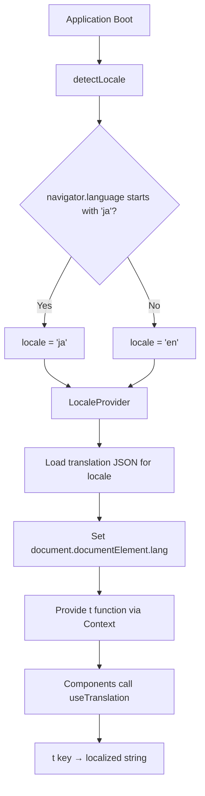

# Design Document: i18n-localization

## Overview

This design introduces a lightweight, custom internationalization (i18n) system for the DopexLegends application. The system auto-detects the user's browser language and provides localized strings for all UI text and game data names in either Japanese or English.

The solution is intentionally minimal — no external i18n libraries are used. The scope is limited to 2 locales with no pluralization, date formatting, or number formatting requirements. The architecture follows React's context pattern to provide a `useTranslation` hook that any component can consume.

### Key Design Decisions

1. **Custom solution over library**: With only 2 locales and no complex formatting needs, a ~100-line custom implementation avoids the bundle size and complexity of libraries like react-i18next.
2. **Static JSON translation files**: Translations live in `src/i18n/locales/ja.json` and `src/i18n/locales/en.json`, imported statically at build time. No lazy loading needed for 2 small files.
3. **Context + hook pattern**: A `LocaleProvider` wraps the app, and `useTranslation()` returns the `t()` function. This matches existing patterns in the codebase (`AppProvider`/`useAppContext`).
4. **Game data localization via translation keys**: Legend names, weapon names, etc. are looked up by their `id` from translation files rather than stored directly on data objects. The `name` field on data types becomes unnecessary for display — components use `t(`legends.${legend.id}`)` instead.

## Architecture



### Module Structure

```
src/i18n/
├── index.ts              # Public exports (useTranslation, LocaleProvider, Locale type)
├── types.ts              # TypeScript types for i18n
├── detectLocale.ts       # Browser language detection logic
├── context.tsx           # React context + provider + hook
├── translate.ts          # Core t() function logic (key lookup + interpolation)
└── locales/
    ├── en.json           # English translations
    └── ja.json           # Japanese translations
```

### Integration Point

The `LocaleProvider` wraps the application at the top level in `main.tsx` (or `App.tsx`), above `AppProvider`, so all components including those within `AppProvider` can access translations.

```tsx
// src/main.tsx
<LocaleProvider>
  <AppProvider>
    <App />
  </AppProvider>
</LocaleProvider>
```

## Components and Interfaces

### detectLocale

```typescript
// src/i18n/detectLocale.ts
export type Locale = 'ja' | 'en';

/**
 * Detects the active locale from the browser's navigator.language.
 * Returns 'ja' if the browser language starts with "ja", otherwise 'en'.
 */
export function detectLocale(): Locale {
  const lang = navigator.language ?? '';
  return lang.startsWith('ja') ? 'ja' : 'en';
}
```

### translate (core t function)

```typescript
// src/i18n/translate.ts
export type TranslationParams = Record<string, string | number>;
export type TranslationDictionary = Record<string, string>;

/**
 * Resolves a dot-notation key against a flat dictionary.
 * Supports interpolation with {{paramName}} syntax.
 * Returns the key itself if not found (fallback behavior).
 */
export function translate(
  dictionary: TranslationDictionary,
  key: string,
  params?: TranslationParams
): string {
  const template = dictionary[key];
  if (template === undefined) return key;
  if (!params) return template;

  return template.replace(/\{\{(\w+)\}\}/g, (_, paramName) => {
    const value = params[paramName];
    return value !== undefined ? String(value) : `{{${paramName}}}`;
  });
}
```

### LocaleContext and Provider

```typescript
// src/i18n/context.tsx
import { createContext, useContext, useMemo, useEffect } from 'react';
import type { ReactNode } from 'react';
import type { Locale, TranslationParams, TranslationDictionary } from './types';
import { detectLocale } from './detectLocale';
import { translate } from './translate';
import en from './locales/en.json';
import ja from './locales/ja.json';

interface LocaleContextValue {
  locale: Locale;
  t: (key: string, params?: TranslationParams) => string;
}

const dictionaries: Record<Locale, TranslationDictionary> = { en, ja };
const LocaleContext = createContext<LocaleContextValue | null>(null);

export function LocaleProvider({ children }: { children: ReactNode }) {
  const locale = useMemo(() => detectLocale(), []);
  const dictionary = dictionaries[locale];

  // Set <html lang="..."> attribute
  useEffect(() => {
    document.documentElement.lang = locale;
  }, [locale]);

  const t = useMemo(
    () => (key: string, params?: TranslationParams) => translate(dictionary, key, params),
    [dictionary]
  );

  const value: LocaleContextValue = useMemo(() => ({ locale, t }), [locale, t]);

  return <LocaleContext.Provider value={value}>{children}</LocaleContext.Provider>;
}

export function useTranslation() {
  const context = useContext(LocaleContext);
  if (!context) {
    throw new Error('useTranslation must be used within LocaleProvider');
  }
  return context;
}
```

### Component Usage Pattern

Before (current):
```tsx
<h2>レジェンドガチャ</h2>
<button aria-label="レジェンドガチャ実行">
  {isAnimating ? '抽選中...' : 'レジェンドガチャ実行'}
</button>
<span>{legend.name}</span>
```

After (with i18n):
```tsx
const { t } = useTranslation();

<h2>{t('legendGacha.title')}</h2>
<button aria-label={t('legendGacha.execute')}>
  {isAnimating ? t('common.drawing') : t('legendGacha.execute')}
</button>
<span>{t(`legends.${legend.id}`)}</span>
```

## Data Models

### Translation File Schema

Translation files are flat JSON objects with dot-notation keys. All keys must exist in both `en.json` and `ja.json`.

```json
// src/i18n/locales/en.json (example subset)
{
  "app.title": "DopexLegends",
  "app.seasonBadge": "Season 30",
  "app.profileButton": "Profile Settings",

  "common.drawing": "Drawing...",
  "common.execute": "Execute",
  "common.enabled": "Enabled",
  "common.reset": "Reset",
  "common.apply": "Apply",
  "common.unapply": "Unapply",

  "legendGacha.title": "Legend Gacha",
  "legendGacha.execute": "Execute Legend Gacha",
  "legendGacha.pickCandidates": "Pick candidates:",
  "legendGacha.result": "Pick Result",
  "legendGacha.candidate": "Candidate {{index}}",
  "legendGacha.lineupSettings": "Legend Lineup Settings",
  "legendGacha.noLegendsError": "Please select at least 1 legend",
  "legendGacha.insufficientError": "Insufficient legends for gacha. Check your lineup or profile owned legends settings",

  "weaponGacha.title": "Weapon Gacha",
  "weaponGacha.executeAll": "Execute All Slots Gacha",
  "weaponGacha.slot1": "Slot 1 Gacha",
  "weaponGacha.slot2": "Slot 2 Gacha",
  "weaponGacha.sling": "Sling Gacha",
  "weaponGacha.lineupSettings": "Weapon Lineup Settings",

  "roulette.title": "Rule Roulette",
  "roulette.spinAll": "Spin All Roulettes",
  "roulette.spin": "Spin",

  "legends.bangalore": "Bangalore",
  "legends.wraith": "Wraith",

  "weapons.flatline": "Flatline",
  "weapons.r-301": "R-301",

  "rules.assault-only": "Assault Class Only",
  "rules.shotgun-required": "Weapon 1: Shotgun Only",

  "categories.Shotgun": "Shotgun",
  "categories.SMG": "SMG",
  "categories.Pistol": "Pistol",
  "categories.AR": "Assault Rifle",
  "categories.LMG": "LMG",
  "categories.Marksman": "Marksman",
  "categories.Sniper": "Sniper",

  "ammoTypes.Shotgun": "Shotgun",
  "ammoTypes.Light": "Light",
  "ammoTypes.Heavy": "Heavy",
  "ammoTypes.Energy": "Energy",
  "ammoTypes.Sniper": "Sniper",
  "ammoTypes.Arrow": "Arrow",

  "classes.Assault": "Assault",
  "classes.Skirmisher": "Skirmisher",
  "classes.Recon": "Recon",
  "classes.Support": "Support",
  "classes.Controller": "Controller"
}
```

### TypeScript Types

```typescript
// src/i18n/types.ts
export type Locale = 'ja' | 'en';

export type TranslationParams = Record<string, string | number>;

/**
 * A flat dictionary mapping dot-notation keys to translated strings.
 * Keys use the pattern: namespace.keyName
 * Values may contain {{paramName}} interpolation placeholders.
 */
export type TranslationDictionary = Record<string, string>;

export interface LocaleContextValue {
  /** The current active locale */
  locale: Locale;
  /** Translation function: resolves a key to a localized string */
  t: (key: string, params?: TranslationParams) => string;
}
```

### Key Namespace Convention

| Namespace | Purpose | Example Key |
|-----------|---------|-------------|
| `app.*` | App-level chrome (title, badges) | `app.title` |
| `common.*` | Shared across components | `common.drawing` |
| `legendGacha.*` | Legend gacha UI | `legendGacha.execute` |
| `weaponGacha.*` | Weapon gacha UI | `weaponGacha.slot1` |
| `roulette.*` | Rule roulette UI | `roulette.title` |
| `profile.*` | User profile UI | `profile.title` |
| `admin.*` | Admin panel UI | `admin.title` |
| `legends.*` | Legend display names (by id) | `legends.bangalore` |
| `weapons.*` | Weapon display names (by id) | `weapons.flatline` |
| `rules.*` | Rule display names (by id) | `rules.assault-only` |
| `categories.*` | Weapon category names | `categories.AR` |
| `ammoTypes.*` | Ammo type display names | `ammoTypes.Heavy` |
| `classes.*` | Legend class display names | `classes.Assault` |
| `errors.*` | Error messages | `errors.noLegends` |


## Correctness Properties

*A property is a characteristic or behavior that should hold true across all valid executions of a system — essentially, a formal statement about what the system should do. Properties serve as the bridge between human-readable specifications and machine-verifiable correctness guarantees.*

### Property 1: Locale Detection Correctness

*For any* string value of `navigator.language`, `detectLocale()` SHALL return `'ja'` if and only if the string starts with `"ja"`, and `'en'` otherwise. The function must always return one of these two values and never throw.

**Validates: Requirements 1.2, 1.3**

### Property 2: Translation Key Format

*For any* key in either translation dictionary (en.json or ja.json), the key SHALL match the dot-notation pattern consisting of a namespace segment followed by one or more dot-separated identifier segments (e.g., `namespace.keyName` or `namespace.sub-key`).

**Validates: Requirements 2.3**

### Property 3: Translation File Symmetry

*For any* key present in the English translation dictionary, that same key SHALL also be present in the Japanese translation dictionary, and vice versa. Both files must have identical key sets.

**Validates: Requirements 2.4**

### Property 4: Key Lookup Correctness

*For any* key that exists in a translation dictionary, `translate(dictionary, key)` SHALL return the exact value stored at that key in the dictionary (not the key itself).

**Validates: Requirements 3.1**

### Property 5: Interpolation Replacement

*For any* template string containing `{{paramName}}` placeholders and a params object providing values for all placeholder names, `translate(dictionary, key, params)` SHALL produce a result that contains none of the original `{{...}}` placeholders and contains all provided param values as substrings.

**Validates: Requirements 3.2**

### Property 6: Missing Key Fallback

*For any* string key that does NOT exist in the translation dictionary, `translate(dictionary, key)` SHALL return the key itself unchanged.

**Validates: Requirements 3.3**

### Property 7: Game Data Name Coverage

*For any* legend id in the LEGENDS array, weapon id in the WEAPONS array, or rule id in the RULES array, both translation files SHALL contain a non-empty string value at the corresponding key (`legends.{id}`, `weapons.{id}`, or `rules.{id}`).

**Validates: Requirements 5.1, 5.2, 5.3, 5.4, 5.5, 5.6**

### Property 8: Game Enum Coverage

*For any* value in the WeaponCategory union type, AmmoType union type, or LegendClass union type, both translation files SHALL contain a non-empty string value at the corresponding key (`categories.{value}`, `ammoTypes.{value}`, or `classes.{value}`).

**Validates: Requirements 5.7, 5.8**

## Error Handling

### Missing Translation Keys

When `t(key)` is called with a key not present in the active locale's dictionary, the function returns the key string itself. This ensures:
- The app never crashes due to a missing translation
- Missing translations are visually obvious during development (raw key strings appear in UI)
- No error is thrown — graceful degradation

### Invalid Interpolation Parameters

When a template contains `{{paramName}}` but the provided params don't include that name:
- The placeholder remains as-is in the output: `{{paramName}}`
- No error is thrown
- This makes debugging easy — unresolved placeholders are visible

### Empty navigator.language

If `navigator.language` is `undefined`, `null`, or empty string:
- The `??` fallback ensures we operate on an empty string
- `''.startsWith('ja')` is `false`, so locale defaults to `'en'`
- English is the safe default for unknown locales

### Translation File Load Failure

Since translation files are statically imported at build time (via Vite's JSON import), a missing file will cause a build error rather than a runtime error. This is caught during development and CI, never in production.

## Testing Strategy

### Property-Based Tests (fast-check)

Property-based testing is highly applicable to this feature. The core i18n functions are pure (no side effects) and have clear input/output contracts with large input spaces. The project already uses `fast-check`.

Each property test runs a minimum of 100 iterations and is tagged with its design property reference.

| Property | Test Target | Generator Strategy |
|----------|-------------|-------------------|
| P1: Locale Detection | `detectLocale()` | Random strings, partitioned by "ja" prefix |
| P2: Key Format | Translation file keys | Enumerate all keys from both JSON files |
| P3: File Symmetry | en.json vs ja.json | Enumerate all keys from both files |
| P4: Key Lookup | `translate()` | Random key selection from dictionary |
| P5: Interpolation | `translate()` with params | Random templates with random param values |
| P6: Missing Key Fallback | `translate()` | Random strings guaranteed not in dictionary |
| P7: Game Data Coverage | Translation files + data arrays | Enumerate all legend/weapon/rule ids |
| P8: Game Enum Coverage | Translation files + type values | Enumerate all category/ammo/class values |

**Configuration:**
- Library: `fast-check` (already in devDependencies)
- Runner: `vitest` (already configured)
- Min iterations: 100 per property
- Tag format: `Feature: i18n-localization, Property {N}: {title}`

### Unit Tests (example-based)

| Test | What It Verifies |
|------|-----------------|
| LocaleProvider sets `document.documentElement.lang` to 'ja' | Requirement 6.1 |
| LocaleProvider sets `document.documentElement.lang` to 'en' | Requirement 6.2 |
| useTranslation throws outside LocaleProvider | Context safety |
| Locale is determined once and doesn't change on re-render | Requirement 1.4 |
| No language switcher UI element rendered | Requirement 7.1 |

### Integration Tests

| Test | What It Verifies |
|------|-----------------|
| LegendGacha renders all text in English when locale='en' | Requirement 4.4 |
| WeaponGacha renders all text in Japanese when locale='ja' | Requirement 4.4 |
| Component renders legend names from translation file | Requirements 5.1, 5.2 |

### Test File Organization

```
src/i18n/
├── __tests__/
│   ├── detectLocale.test.ts       # P1 property test + unit tests
│   ├── translate.test.ts          # P4, P5, P6 property tests
│   ├── translationFiles.test.ts   # P2, P3, P7, P8 property tests
│   └── context.test.tsx           # Unit + integration tests for React context
```
