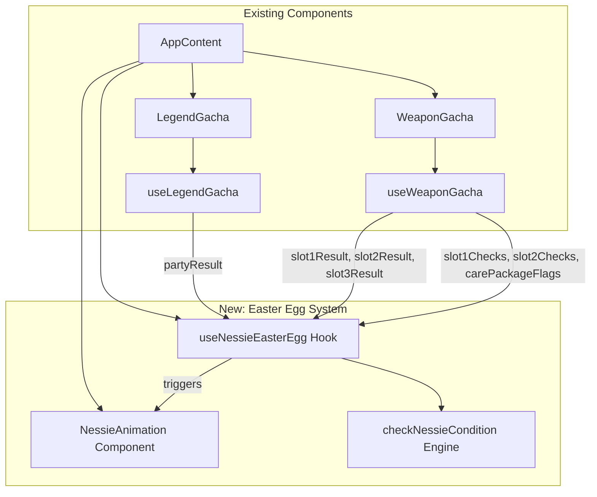

# Design Document: Nessie Easter Egg

## Overview

DopexLegendsのApex Legendsガチャシステムに「ネッシーイースターエッグ」を追加する。レジェンドガチャで「バリスティック」がパーティに含まれ、武器ラインナップが全武器有効（絞り込みなし）の状態で武器ガチャを実行し、スロット1・スロット2・スリング（スロット3）が全て同一武器になった場合、ネッシー画像が画面の左下から右下へアニメーションで横断する。

### 設計方針

- **純粋関数で条件判定**: イースターエッグの発動条件判定を純粋関数（`checkNessieCondition`）として実装し、テスタビリティを確保する
- **既存アーキテクチャに準拠**: プロジェクトの既存パターン（カスタムHook + エンジン分離 + CSS Modules）に従う
- **非侵入的**: アニメーションはポータル的にAppレベルで描画し、既存コンポーネントのレンダリングツリーに影響しない

## Architecture



### データフロー

1. `WeaponGacha`コンポーネントで「全スロットガチャ実行」が完了する
2. `useNessieEasterEgg` Hookが`legendGacha.partyResult`と`weaponGacha`の結果・ラインナップ状態を監視
3. 条件判定エンジン`checkNessieCondition`が全条件を評価
4. 条件成立時、`NessieAnimation`コンポーネントがアニメーションを開始

## Components and Interfaces

### 1. Easter Egg Detection Engine (`src/engines/nessieEasterEggEngine.ts`)

条件判定の純粋関数群。副作用なし、テスト容易。

```typescript
export interface NessieConditionInput {
  /** レジェンドガチャのパーティ結果 */
  partyResult: Legend[] | null;
  /** スロット1の武器チェック状態 */
  slot1Checks: Map<string, boolean>;
  /** スロット2の武器チェック状態 */
  slot2Checks: Map<string, boolean>;
  /** ケアパッケージフラグ */
  carePackageFlags: Map<string, boolean>;
  /** スロット1の結果 */
  slot1Result: Weapon | null;
  /** スロット2の結果 */
  slot2Result: Weapon | null;
  /** スリング（スロット3）の結果 */
  slot3Result: Weapon | null;
}

/**
 * ネッシーイースターエッグの全条件を判定する。
 * 条件: Ballistic in party AND slot1全武器有効 AND slot2全武器有効 AND 3スロット同一武器
 */
export function checkNessieCondition(input: NessieConditionInput): boolean;

/**
 * パーティ結果にBallistic（hasThirdWeaponSlot === true）が含まれるか判定。
 */
export function hasBallistic(partyResult: Legend[] | null): boolean;

/**
 * 指定スロットが「全武器有効」状態か判定。
 * ケアパッケージ武器を除く全武器がチェック済みであること。
 */
export function isAllWeaponsEnabled(
  slotChecks: Map<string, boolean>,
  carePackageFlags: Map<string, boolean>
): boolean;

/**
 * 3スロットの結果が全て同一武器IDか判定。
 */
export function isSameWeaponAllSlots(
  slot1Result: Weapon | null,
  slot2Result: Weapon | null,
  slot3Result: Weapon | null
): boolean;
```

### 2. Easter Egg Hook (`src/hooks/useNessieEasterEgg.ts`)

条件監視とアニメーション状態管理を行うカスタムHook。

```typescript
export interface UseNessieEasterEggReturn {
  /** アニメーション表示中か */
  isPlaying: boolean;
  /** アニメーションを開始するトリガー（条件判定後に呼ばれる） */
  trigger: () => void;
  /** アニメーション完了コールバック */
  onAnimationEnd: () => void;
}
```

このHookは`AppContent`コンポーネント内で使用し、武器ガチャの結果が変更されるたびに条件を再評価する。`useEffect`で`slot1Result`, `slot2Result`, `slot3Result`の変更を監視し、条件が満たされた場合にアニメーションを発火する。

### 3. Nessie Animation Component (`src/components/shared/NessieAnimation.tsx`)

CSS keyframeアニメーションでネッシー画像を表示するプレゼンテーションコンポーネント。

```typescript
export interface NessieAnimationProps {
  /** アニメーション表示中か */
  isPlaying: boolean;
  /** アニメーション完了時のコールバック */
  onAnimationEnd: () => void;
}
```

- `position: fixed` で画面下端に固定
- `z-index` を高い値に設定し最前面表示
- CSS keyframeで`translateX(-100%)` → `translateX(100vw)` の水平移動
- アニメーション持続時間: 3秒
- `onAnimationEnd`イベントで完了検知し非表示化

### 4. CSS Module (`src/components/shared/NessieAnimation.module.css`)

```css
.nessieContainer {
  position: fixed;
  bottom: 0;
  left: 0;
  z-index: 9999;
  pointer-events: none; /* ユーザー操作を妨げない */
}

.nessieImage {
  animation: nessieWalk 3s linear forwards;
}

@keyframes nessieWalk {
  from {
    transform: translateX(-100%);
  }
  to {
    transform: translateX(100vw);
  }
}
```

## Data Models

### 既存データモデルへの変更

既存のデータモデル（`Legend`, `Weapon`, `WeaponLineupState`等）に変更は不要。イースターエッグの判定ロジックは既存の状態を読み取るだけで、新たなデータ構造の追加は最小限に留める。

### 新規型定義

```typescript
/** ネッシー条件判定の入力型（上記NessieConditionInput） */
// src/engines/nessieEasterEggEngine.ts に定義

/** Hookの返り値型（上記UseNessieEasterEggReturn） */
// src/hooks/useNessieEasterEgg.ts に定義
```

### 状態管理

- アニメーション状態（`isPlaying`）はReactの`useState`でローカル管理
- localStorageへの永続化は不要（エフェメラルな演出のため）
- `AppContext`への追加は不要（アニメーション状態は`AppContent`コンポーネント内で完結）

## Correctness Properties

*A property is a characteristic or behavior that should hold true across all valid executions of a system—essentially, a formal statement about what the system should do. Properties serve as the bridge between human-readable specifications and machine-verifiable correctness guarantees.*

### Property 1: Nessie condition is a biconditional

*For any* combination of party result, weapon lineup checks (slot1, slot2), care package flags, and weapon slot results (slot1, slot2, slot3), `checkNessieCondition` returns `true` if and only if: (1) the party result contains at least one legend with `hasThirdWeaponSlot === true`, AND (2) slot1Checks has all non-care-package weapons checked, AND (3) slot2Checks has all non-care-package weapons checked, AND (4) slot1Result, slot2Result, and slot3Result are all non-null and share the same weapon ID.

**Validates: Requirements 1.1, 1.2, 1.3, 1.4**

### Property 2: Detection is stateless

*For any* valid `NessieConditionInput`, the result of `checkNessieCondition` depends only on the current input values and not on any prior invocations or external state. Calling the function multiple times with the same input always produces the same result, and calling it with a qualifying input after a non-qualifying input still returns `true`.

**Validates: Requirements 4.1**

### Property 3: All-weapons-enabled is invariant to weapon order and count

*For any* set of non-care-package weapons and a slot checks map, `isAllWeaponsEnabled` returns `true` if and only if every weapon ID that exists in the checks map with a corresponding `carePackageFlags.get(id) !== true` has its check set to `true`.

**Validates: Requirements 1.1, 1.3**

## Error Handling

| シナリオ | 対応 |
|---------|------|
| `partyResult`が`null` | `hasBallistic`が`false`を返す → アニメーション非発動 |
| スロット結果のいずれかが`null` | `isSameWeaponAllSlots`が`false`を返す → アニメーション非発動 |
| `nessie.png`の読み込み失敗 | ``の`onError`で静かに非表示化（ユーザー体験を損なわない） |
| アニメーション中にコンポーネントがアンマウント | `useEffect`のクリーンアップでタイマー/状態をリセット |
| 再トリガー（アニメーション中に再度条件成立） | 現在のアニメーションをリセットし最初から再開（CSSアニメーションの`key`プロパティ変更で実現） |

## Testing Strategy

### Property-Based Tests (fast-check)

プロジェクトには既に`fast-check`が`devDependencies`に含まれているため、これを使用する。

**テスト対象**: `src/engines/nessieEasterEggEngine.ts` の純粋関数群

- 各プロパティテストは最低100イテレーション実行
- タグ形式: `Feature: nessie-easter-egg, Property {number}: {property_text}`

**テストファイル**: `src/engines/__tests__/nessieEasterEggEngine.test.ts`

### Unit Tests (vitest)

**テスト対象**:
- `NessieAnimation`コンポーネントの描画テスト（`@testing-library/react`使用）
  - アニメーション発火時にimg要素がDOMに存在すること
  - `isPlaying: false`時にimg要素が非表示であること
  - `onAnimationEnd`コールバックが正しく呼ばれること
  - `position: fixed`とz-indexの検証
- `useNessieEasterEgg` Hookの統合テスト
  - 条件成立時に`isPlaying`が`true`になること
  - 再トリガー時にアニメーションがリセットされること

### テストコマンド

```bash
npm run test
```

（vitest --run で実行。fast-checkテストも同一コマンドで実行される）
